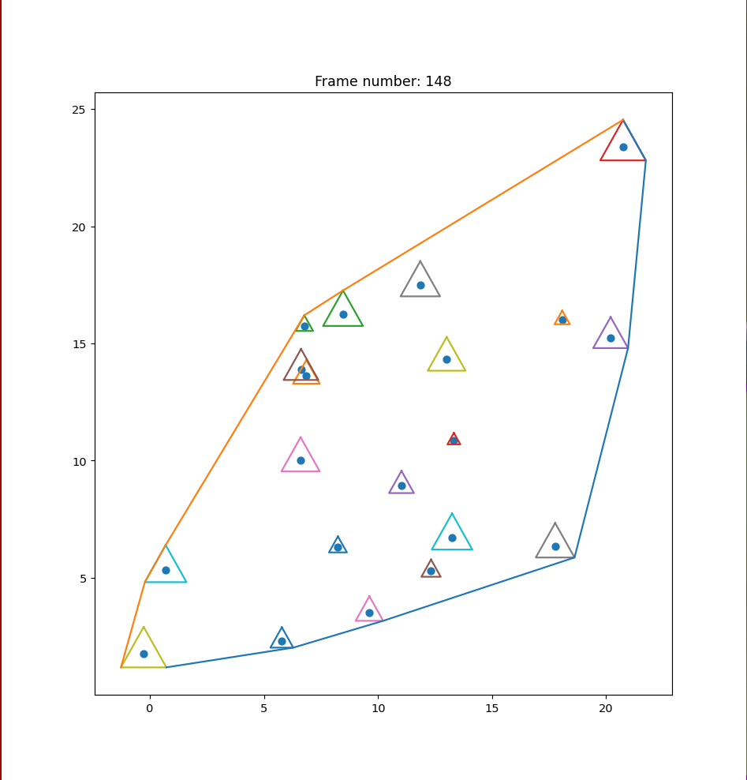

## Finding corner points of convex hull
# About
Finding corner points of convex hull using Jarvis March algorithm and animation. All points (tigers) have triangular halo around them which vertices are also taking part in creation of convex hull.
# Animation screenshot

# Used packages
 - matplotlib
 - numpy
